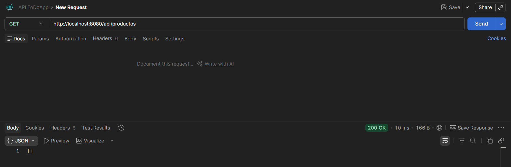
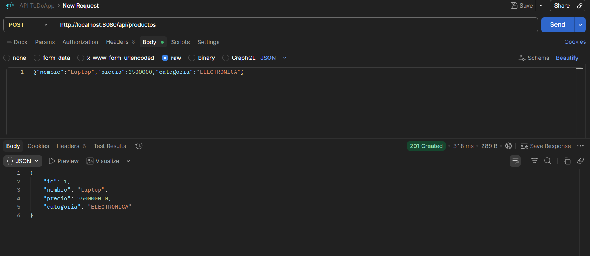
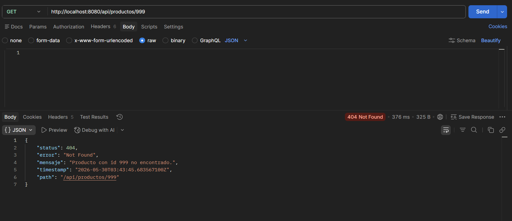
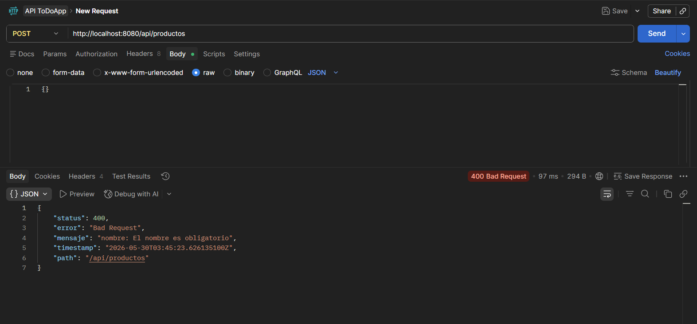

Proyecto: catalogo
=================

API REST simple para gestionar productos (Spring Boot, Spring Data JPA, H2 en memoria).

Arquitectura (diagrama de capas)
--------------------------------

Descripción general:
La aplicación sigue una arquitectura en capas para separar responsabilidades, facilitar pruebas y mantener el código.

### Capa Web (Controller)
- Clase: com.empresa.catalogo.controller.ProductoController
- Responsabilidad: Exponer endpoints REST, recibir ProductoRequestDTO y devolver ProductoResponseDTO.

### Capa de Transporte / Mapeo (DTO y Factory)
- DTOs: com.empresa.catalogo.dto.ProductoRequestDTO, ProductoResponseDTO
- Factory: com.empresa.catalogo.factory.ProductoFactory (convierte DTO <-> Entity)

### Capa de Negocio (Service)
- Interfaces/Impl: com.empresa.catalogo.service.ProductoService, ProductoServiceImpl
- Responsabilidad: Orquestar operaciones, aplicar reglas de negocio y validar antes de persistir.

### Capa de Persistencia (Repository / Entity)
- Repository: com.empresa.catalogo.repository.ProductoRepository (extends JpaRepository)
- Entity: com.empresa.catalogo.entity.Producto
- Responsabilidad: Interacción con la base de datos (H2 en memoria por defecto).

### Flujo (resumen):
Controller -> DTO/Factory -> Service -> Repository -> Entity

### Componentes transversales:
- com.empresa.catalogo.exception.GlobalExceptionHandler: captura excepciones y normaliza respuestas de error en ApiError.
- com.empresa.catalogo.exception.ApiError: DTO usado para respuestas de error (status, error, mensaje, timestamp, path).

Ejecución local
---------------
### Requisitos:
- Java 17+
- Maven

### Comandos útiles:
- Compilar y empaquetar:
  `mvn -DskipTests package` mvn 
- Ejecutar la aplicación en modo desarrollo:
  mvn -DskipTests spring-boot:run
- Ejecutar JAR generado:
  java -jar target/catalogo-0.0.1-SNAPSHOT.jar

Endpoints de ejemplo
--------------------
- GET /api/productos        → listar productos activos
- POST /api/productos       → crear producto (body JSON con nombre, precio, categoria)
- GET /api/productos/{id}   → obtener producto por id
- DELETE /api/productos/{id}→ eliminar producto

Checkpoints (evidencias)
------------------------
## 1) Compilación / empaquetado exitosa:
[INFO] BUILD SUCCESS
Total time:  5.805 s
Finished at: 2026-05-29T23:49:51-04:00

## 2) Respuestas de la API (capturas arriba):
### GET /api/productos → 200 OK + lista de productos
  
### POST /api/productos (con JSON válido) → 201 Created + producto creado
  
3) Manejo de errores:
### GET /api/productos/999 → 404 Not Found + mensaje "Producto no encontrado"
  
### POST /api/productos (con JSON inválido) → 400 Bad Request + mensaje "JSON parse error"
  

Notas y recomendaciones
----------------------
- Si al ejecutar mvn spring-boot:run aparece "Port 8080 already in use", detener el proceso que usa 8080 o arrancar con otra propiedad:
  mvn -DskipTests spring-boot:run -Dspring-boot.run.arguments="--server.port=8081"
- Para pruebas de integración, añadir tests y datos de ejemplo en src/test/resources.

